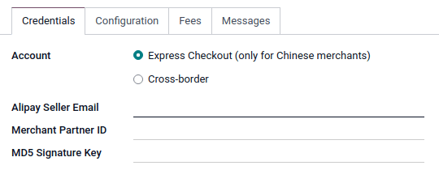
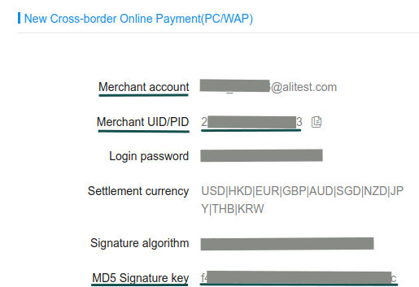

======
Alipay
======

`Alipay <https://www.alipay.com/>`_ is an online payments platform established in China by Alibaba
Group.

Configuration
=============

To proceed your payments with Alipay, you need an Alipay account that's not in the sandbox
environment.

.. note::
   Please refer to :ref:`Add a new Payment Acquirer <payment_acquirers/add_new>` to read how to
   enable this payment acquirer on Odoo.

Credentials tab
---------------

Odoo needs your **API Credentials** to connect with your Alipay account, which comprise:

- *Account*: Depending on where you are situated
  * `Express Checkout` if your are a Chinese Merchant.
  * `Cross-border` if you are not.
- *Alipay Seller Email*: Your public Alipay partner email (for express checkout only).
- *Merchant Partner ID*: The public partner ID solely used to identify the account with Alipay.
- *MD5 Signature Key*: The signature key.

You can copy your credentials from your Alipay account, and paste them in the related fields under
the **Credentials** tab.

To retrieve them, log into your Alipay account, they are on the front page.

.. important::
   If you are trying Alipay as a test, in the *sandbox*, change the **State** to *Test Mode*. We
   recommend doing this on a test Odoo database, rather than on your main database.

.. seealso::
   - `Alipay: Sign Up <https://global.alipay.com/open/account/register.htm?_route=QK>`_
   - :doc:`../payment_acquirers`
