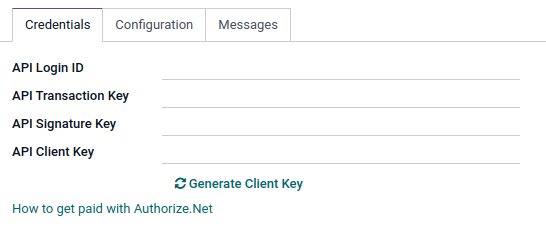

=============
Authorize.Net
=============

`Authorize.Net <https://www.authorize.net>`__ is a United States-based online payment solution
provider, allowing businesses to accept **credit cards**.

Configuration
=============

To proceed your payments with Authorize.net, you need an Authorize.net account that's not in the
sandbox environment.

.. note::
   Please refer to :ref:`Add a new Payment Acquirer <payment_acquirers/add_new>` to read how to
   enable this payment acquirer on Odoo.

Credentials tab
---------------

Odoo needs your **API Credentials & Keys** to connect with your Authorize.Net account, which
comprise:

- API Login ID: The ID solely used to identify the account with Authorize.Net.
- API Transaction Key
- API Signature Key
- API Client Key

To retrieve them, log into your Authorize.Net account, go to :menuselection:`Account --> Settings
--> Security Settings --> API Credentials & Keys`, generate your **Transaction Key** and
**Signature Key**, and paste them on the related fields.

.. image:: media/authorize-api-keys.png
   :align: center
   :alt: Generate your Transaction Key and Signature Key on your Authorize.Net account
   :width: 500

From Odoo, you can then click on **Generate Client Key**.

.. important::
   If you are trying Authorize.Net as a test, with a *sandbox account*, change the **State** to
   *Test Mode*. We recommend doing this on a test Odoo database, rather than on your main database.

Configuration tab
-----------------

Capture the payment after the delivery
~~~~~~~~~~~~~~~~~~~~~~~~~~~~~~~~~~~~~~

With Authorize.net, you can enable the :ref:`manual capture <payment_acquirers/capture_amount>`. If
enabled, the funds are reserved for 30 days on the customer's card, but not charged yet.

.. warning::
   After **30 days**, the transaction is **voided automatically** by Authorize.net.

.. seealso::
   - `Authorize.Net: Getting Started Guide
     <https://support.authorize.net/s/article/Authorize-Net-Getting-Started-Guide>`_
   - :doc:`../payment_acquirers`
