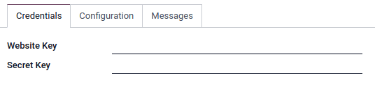
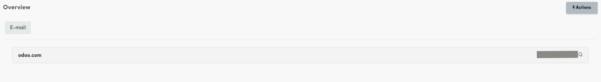
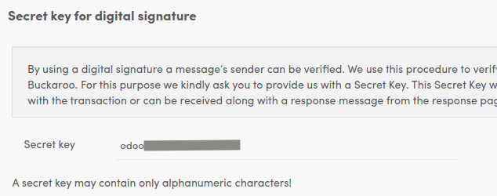

========
Buckaroo
========

`Buckaroo <https://www.buckaroo.eu/>`_ is a Dutch-based company that offers several online payment
possibilities.

Configuration
=============

A Buckaroo account in the live environment is needed to get paid with Buckaroo. Create a live
account or upgrade your test account to a live account.

.. note::
   Please refer to :ref:`Add a new Payment Acquirer <payment_acquirers/add_new>` to read how to
   enable this payment acquirer on Odoo.

Credentials tab
---------------

Odoo needs your **API Credentials** to connect with your Buckaroo account, which comprise:

- :ref:`Website Key <buckaroo/website_key>`: The key solely used to identify the website with
  Buckaroo.
- :ref:`Secret Key <buckaroo/secret_key>`: The secret key you entered on Buckaroo.

You can copy your credentials from your Buckaroo account, and paste them in the related fields under
the **Credentials** tab.

.. _buckaroo/website_key:

Website Key
~~~~~~~~~~~

In order to retrieve the Website Key, log into your Buckaroo account, go to
:menuselection:`Configuration --> Templates --> Your Website`

.. _buckaroo/secret_key:

Secret Key
~~~~~~~~~~

In order to retrieve the Website Key, log into your Buckaroo account, go to
:menuselection:`Configuration --> Security --> Secret Key`

.. important::
   If you are trying Buckaroo in a test account, change the **State** to *Test Mode*. We
   recommend doing this on a test Odoo database, rather than on your main database.

.. seealso::
   - `About Buckaroo <https://www.buckaroo.eu/about-us/about-buckaroo>`_
   - :doc:`../payment_acquirers`
