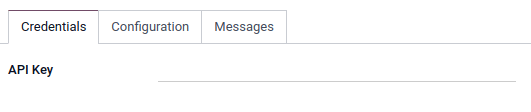
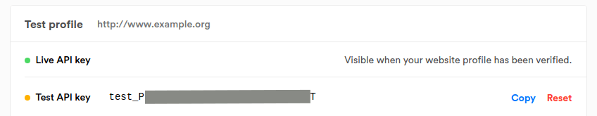

======
Mollie
======

`Mollie <https://www.mollie.com/>`_ is an online payments platform established in the Netherlands.

Configuration
=============

To proceed your payments with Mollie, you need a Mollie account in the live environment.

.. note::
   Please refer to :ref:`Add a new Payment Acquirer <payment_acquirers/add_new>` to read how to
   enable this payment acquirer on Odoo.

Credentials tab
---------------

Odoo needs your **API Credentials** to connect with your Mollie account, which comprise:

- API Key: The test or live API Key depending on the configuration of the acquirer.

You can copy your credentials from your Mollie account, and paste them in the related fields under
the **Credentials** tab.

To retrieve your API key, log into your Mollie account, go to
:menuselection:`Developers --> API keys`, and copy your Test or Live **API Key**.

.. important::
   If you are trying Mollie as a test, with the Test API key, change the **State** to *Test Mode*.
   We recommend doing this on a test Odoo database, rather than on your main database.

.. seealso::
   - `Create a Mollie account <https://www.mollie.com/dashboard/signup?lang=be>`_
   - :doc:`../payment_acquirers`
