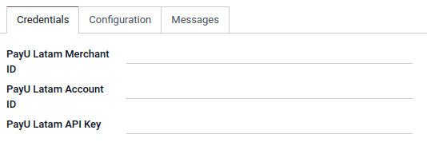

==========
PayU Latam
==========

`PayU Latam <COINCOIN>`_ is the Latine America part of
`PayU <https://corporate.payu.com/about-payu/>`, an online payments platform.

Configuration
=============

To proceed your payments with COINCOIN

.. note::
   Please refer to :ref:`Add a new Payment Acquirer <payment_acquirers/add_new>` to read how to
   enable this payment acquirer on Odoo.

Credentials tab
---------------

Odoo needs your **API Credentials** to connect with your PayU Latam account, which comprise:

- PayU Latam Merchant ID: The ID solely used to identify the account with PayU Latam.
- PayU Latam Account ID: The ID solely used to identify the country-dependant shop with PayU Latam.
- PayU Latam API Key: COINCOIN?

You can copy your credentials from your PayU Latam account, and paste them in the related fields
under the **Credentials** tab.

To retrieve them, COINCOIN

.. important::
   If you are trying PayU Latam as a test, in the *sandbox*, change the **State** to *Test Mode*. We
   recommend doing this on a test Odoo database, rather than on your main database. COINCOIN?

.. seealso::
   - `PayU Latam: Create a PayU Account
     <http://developers.payulatam.com/latam/en/docs/getting-started/create-an-account.html>`_
   - :doc:`../payment_acquirers`
